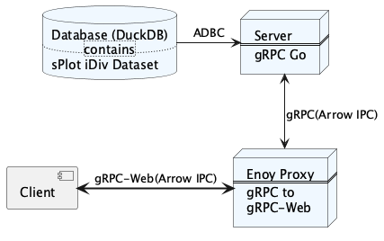
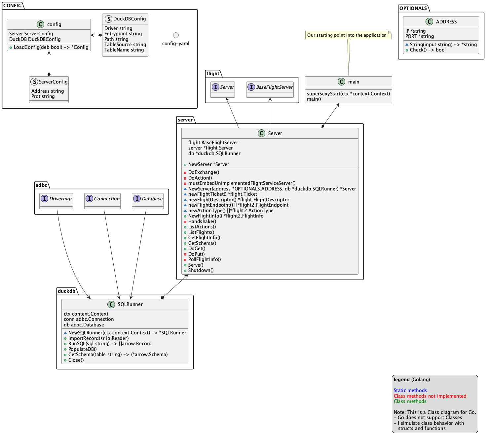

# Go Flight Server
This Project is an implementation of the Apache Arrow
Flight server that sends IPC streams on the gRPC format.

## General principle
This server has the purpose to send responses on request from a
browser. That is why there is a **proxy** included in this
project. The general architecture looks like this:



## Class diagram
To give a better overview I have a class diagram that
provides a general idea of the projects composition.



# Set-up
This project is easy to set up. If you downloaded the Full Project repo
you can jump directly into the start section
## Database
Download the corresponding libduckdb library from [here](https://github.com/duckdb/duckdb/releases)
## Dataset
Download the sPlot library from [here]()

# Start
## Server
````bash
 CGO_CXXFLAGS="-I$(pwd)/third_party" go run .
````

## Proxy
```bash
envoy -c proxy/envoy.yaml
```
or run the run.sh script in the folder, if you want a super light-weight server.